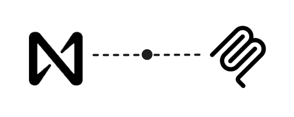

<div align="center">
  
</div>

[](https://badge.fury.io/js/@nearai%2Fnear-mcp)
[](https://t.me/nearaialpha)

# NEAR MCP

This project is a Model Context Protocol ([MCP](https://github.com/modelcontextprotocol)) compatible server for interacting with the [NEAR blockchain](https://near.org/). This tool provides a way for LLMs and AI agents to securely access and interact with NEAR accounts and blockchain functionality.

## Quickstart

Here is how to get started with the near-mcp server quickly with the `claude` code cli

```
npm install -g @anthropic-ai/claude-code
claude mcp add near-mcp npx @nearai/near-mcp@latest run
claude
```

Or deploy the MCP server remotely on Phala Cloud, check the instructions [here](./tee.md)

## Installing

`near-mcp` is meant to be used is with an MCP compatible client. Learn more in the [MCP docs](https://modelcontextprotocol.io/introduction)

Adding to the [`claude` code](https://docs.anthropic.com/en/docs/agents-and-tools/claude-code/overview) cli:

```bash
claude mcp add near-mcp npx @nearai/near-mcp@latest run
```

Adding to claude desktop via JSON config:

```json
{
  "mcpServers": {
    "near-mcp": {
      "command": "npx",
      "args": ["-y", "@nearai/near-mcp@latest", "run"],
      "env": {}
    }
  }
}
```

Adding to [`goose`](https://block.github.io/goose/)

```
┌   goose-configure
│
◇  What would you like to configure?
│  Add Extension
│
◇  What type of extension would you like to add?
│  Command-line Extension
│
◇  What would you like to call this extension?
│  near-mcp
│
◇  What command should be run?
│  npx @nearai/near-mcp@latest run
│
◇  Please set the timeout for this tool (in secs):
│  60
│
◇  Would you like to add environment variables?
│  No
│
└  Added near-mcp extension
```

Or you can install it globally and use it directly.

```bash
# Install globally
npm install -g @nearai/near-mcp@latest

# Or use directly with npx
npx @nearai/near-mcp@latest run
```

## Available Tools

see [TOOLS.md](./TOOLS.md) for a list of available tools and arguments.

## Integration with AI Models

This tool is designed to be used with AI models that support the [Model Context Protocol](https://github.com/modelcontextprotocol). It enables AI assistants to:

1. Manage NEAR accounts on behalf of users
2. Check account balances and status
3. Sign and send transactions
4. Create new accounts and manage access keys
5. Inspect and execution smart contracts

## Security Considerations

- This MCP is meant to be run locally. Account private keys are stored in a local unencrypted keystore where the MCP server is running.
- The underlying models should not have access to see the private keys of the accounts they are interacting with with _one exception_. The `import_account` tool allows the model to import an account from a private key. This requires the user to provide the private key to the model.

## Contributing

We welcome contributions to the NEAR MCP server! Please see the [CONTRIBUTING.md](CONTRIBUTING.md) file for more information.

### Reporting Issues

If you find a bug or have a feature request, please open an issue on the GitHub repository.
